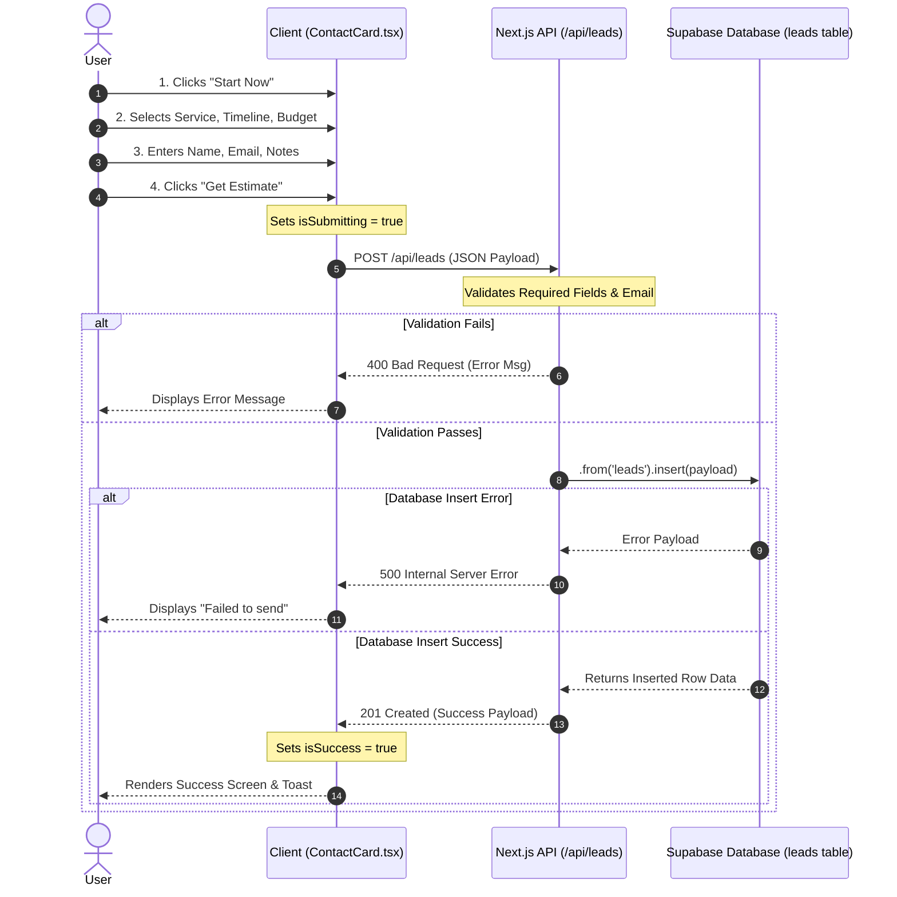

# 🚀 Digital Heroes – Next.js Web Development Landing Page

The **Digital Heroes Landing Page** (PlexLanding 2.0) is a modern, high-performance portfolio and lead generation platform for web development services.  
Built with **Next.js 16 (App Router)** and **Tailwind CSS 4**, it features immersive animations, an interactive multi-step contact wizard, and a secure admin dashboard to seamlessly manage incoming client requests.

---

## 🌟 Overview

This project is designed to provide a stunning first impression to potential clients while maintaining a robust and practical backend architecture for the site owner. It leverages modern React paradigms, Framer Motion for fluid transitions, and Clerk for secure administrative access.

Whether a user is browsing your services or requesting a project estimate through the interactive lead generation form, the experience is optimized for speed, aesthetics, and conversion.

---

## ✨ Features

- ⚡ **Next.js App Router**: Server-side rendering and static generation for peak performance.
- 🎨 **Immersive UI/UX**: Built with Tailwind CSS, Framer Motion, and Lottie animations for a premium feel.
- 🗺️ **Interactive Elements**: Includes interactive dotted maps (`svg-dotted-map`) and 3D globe visualizations (`cobe`).
- 📝 **Multi-Step Contact Wizard**: A sleek, user-friendly form to capture leads, project types, timelines, and budgets.
- 🔐 **Secure Admin Dashboard**: Protected `/admin` route utilizing **Clerk Authentication** to view and manage incoming leads.
- 💾 **API Integration**: RESTful API endpoints for lead submission and status tracking.
- 📱 **Fully Responsive**: Flawless design execution across all device sizes.

---

## 🛠️ Tech Stack

### **Frontend**
- **React 19** & **Next.js 16** (App Router & Turbopack)
- **Tailwind CSS v4** for utility-first styling
- **Framer Motion** for declarative animations
- **Lucide React** & **React Icons** for scalable iconography
- **Lottie React** for vector animations
- **Three.js** & **Cobe** for 3D graphics

### **Backend & Authentication**
- **Clerk** for robust, pre-built authentication (`@clerk/nextjs`)
- **Next.js API Routes** for backend logic
- **Supabase** integration for robust database storage (Leads management)

---

## 📦 Installation & Setup

### 1️⃣ Clone the Repository
```bash
git clone https://github.com/AlokPy1484/landingpage.git
cd landingPage
```

### 2️⃣ Install Dependencies
```bash
npm install
```

### 3️⃣ Environment Variables
Create a `.env.local` file in the root directory and add your keys:
```env
# Clerk Authentication Keys
NEXT_PUBLIC_CLERK_PUBLISHABLE_KEY=your_publishable_key
CLERK_SECRET_KEY=your_secret_key

# Supabase Keys (for Lead Database)
NEXT_PUBLIC_SUPABASE_URL=your_supabase_url
NEXT_PUBLIC_SUPABASE_ANON_KEY=your_supabase_anon_key
```

### 4️⃣ Run the Development Server
```bash
npm run dev
```
Open [http://localhost:3000](http://localhost:3000) in your browser to view the application.  
Navigate to [http://localhost:3000/admin](http://localhost:3000/admin) to access the Clerk-protected dashboard.

---


### 5️⃣ Contact Form's Architecture




## 🤝 Contributing
Contributions, issues, and feature requests are welcome! 
Feel free to check the issues page if you want to contribute.

## 📄 License
This project is open-source and available under the MIT License.
